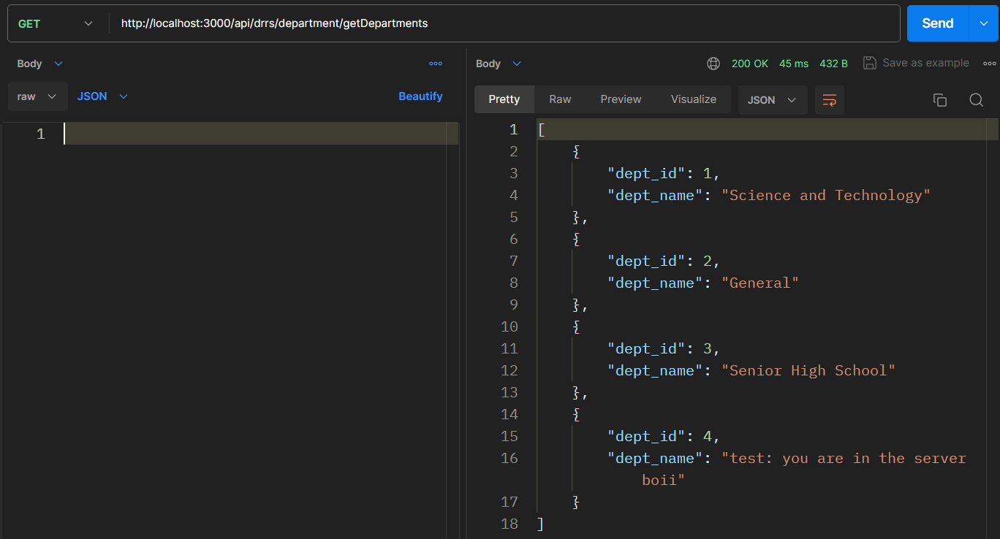

# DRRS Backend
## TODO
- [ ] Fix OAuth login
- [ ] Add tokens on api endpoints for security

## Improvements
- [ ] Wrap crud in promise/ async await
- [ ] Use ORM, currently there are no models
- [ ] Create API documentation in Swagger

## Setup database locally and backend
> NOTE: Only follow these steps if you are planning on using a database locally, otherwise proceed to **setup backend**. The steps below create a local database server for postgres, this is useful if you plan to test or modify the database locally with your own machine using `localhost` without affecting the database server hosted online in `render.com`.

1. Install [postgres](https://www.postgresql.org/download/), keep clicking next and set everything as default. Use **admin** as password or create your own and configure the `.env` file
2. Open terminal type `cd server`, `npm install`
3. Run the `postgres-start.sql` script to create the database, tables, and insert sample data
4. Make sure to edit the `.env` so that it is configured for your own device and usecase i.e. modify the `NODE_ENV` to `development`
5. To run locally type `npm run dev` in the terminal

## Setup backend
> NOTE: If you don't need to modify the database and only plan on working with the backend, follow the steps below to set it up. By default the backend uses the database server hosted online in `render.com`, you can modify the `.env` to change it otherwise.

1. Open terminal type `cd server`, `npm install`
2. To run locally type `npm run dev` in the terminal

## API Endpoints
The API Endpoints allows the users to access the backend functionalities of the application. This can be used to create, read, update, and delete data.

To access the api endpoints go to `URL_SERVER/api/drrs/API_ENDPOINTS` in the browser or through [Postman](https://www.postman.com/downloads/)

> NOTE: The API Endpoints return a `JSON` file, if you are using Chrome, you can install an extenstion called [JSON Formatter](https://chromewebstore.google.com/detail/json-formatter/bcjindcccaagfpapjjmafapmmgkkhgoa?hl=en-US&utm_source=ext_sidebar) to better view the data.

**Accessing the API Endpoints locally**

If the server is hosted locally on your own device go to `http://localhost:3000/api/drrs/department/getDepartments` 

 
**Accessing the API Endpoints through a server**

Go to `https://drrs-render.com/api/drrs/department/getDepartments` if the server is hosted on a public server.

Since the API Endpoints are hosted in the Internet, the data can be accessed easily through any device.
> NOTE: Currently the backend isn't hosted on a server

## DRRS API Endpoints
### Admin

### Department
- `/department/getDepartments` - returns all departments as json. **See image shown in sample above**.

### Librarians

### Logs

### Rooms
