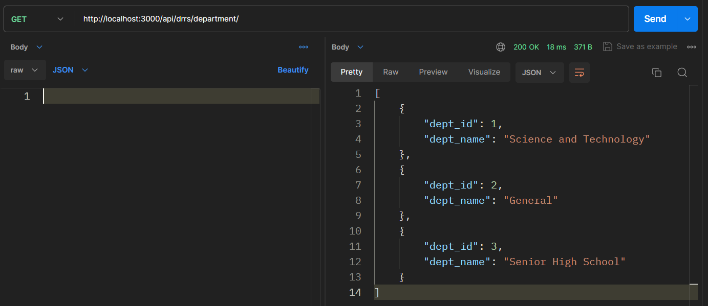

# DRRS Backend
## TODO
- [ ] Fix OAuth login
- [ ] Add tokens on api endpoints for security

## Improvements
- [ ] Wrap crud in promise/ async await
- [ ] Use ORM, currently there are no models

## Setup locally
1. Install [postgres](https://www.postgresql.org/download/), keep clicking next and set everything as default. Use **admin** as password or create your own and configure the `.env` file
2. Open terminal type `cd server`, `npm install`
3. Run the `postgres-start.sql` script to create the database, tables, and insert sample data
4. Make sure to edit the `.env` so that it is configured for your own device and usecase
5. To run locally type `npm run dev` in the terminal

## API Endpoints
To access the api endpoints go to `URL_SERVER/api/drrs/API_ENDPOINTS` in the browser or through [Postman](https://www.postman.com/downloads/)

**Examples**

If the server is hosted locally on your own device go to `http://localhost:3000/api/drrs/getRooms` 
 
Otherwise go to `https://drrs-render.com/api/drrs/getRooms` if the server is hosted on a public server

### Admin

### Department
- `/department/` - returns all departments as json

### Librarians

### Logs

### Rooms
